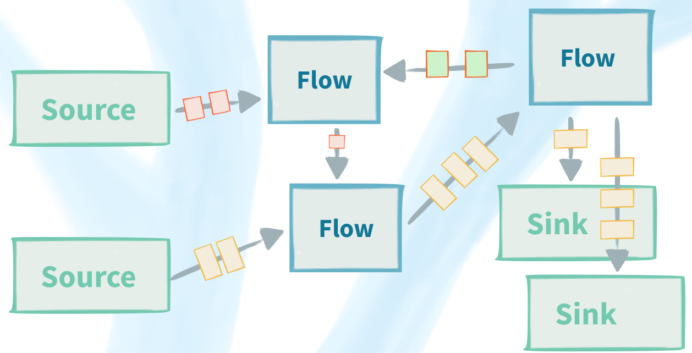

title: 使用Akka Streams、Alpakka和Apache Kafka构建实时流式ETL流水线
category: scala
tags:
  - scala
  - akka
  - akka stream
  - alpakka
  - kafka
  - etl
  - real-time
---

**Akka**：使构建并发和分布式应用更简单。Akka是一个工具库和运行时，用于在JVM平台上构建并发、发布式和弹性的消息驱动应用程序。


## Streams

**Streams** 具有很多含义。

## Akka Streams

支持异步、回压的流处理。

**回压**

```
Source ---------> Flow ---------> Sink
        |                 |
        --(潜在的)异步边界--
```

Source生产能力：10msg/s，Sink处理能力：1msg/s，在Sink的边界最终会造成 OutOfMemoryError （接收buffer不是无限的）。

若Sink在buffer容量为或大于3个时，向Source通知减慢生产速度，而Source能够响应。这便是 **回压**。

**流是非线性的**

Akka Streams支持非线性的流，如：



## 反应式


## 反应式流（Reactive Streams）


Rreactive Streams是一项为非阻塞背压提供异步流处理标准的计划。包括针对运行时和网络协议的工作。

